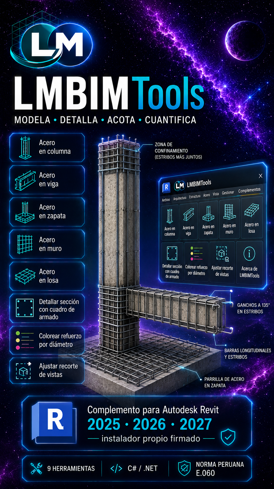
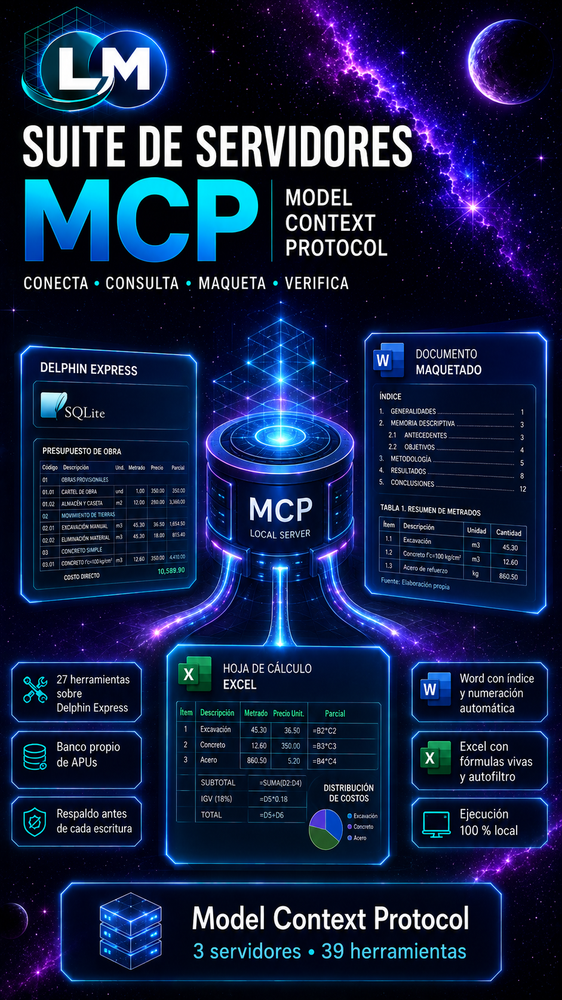
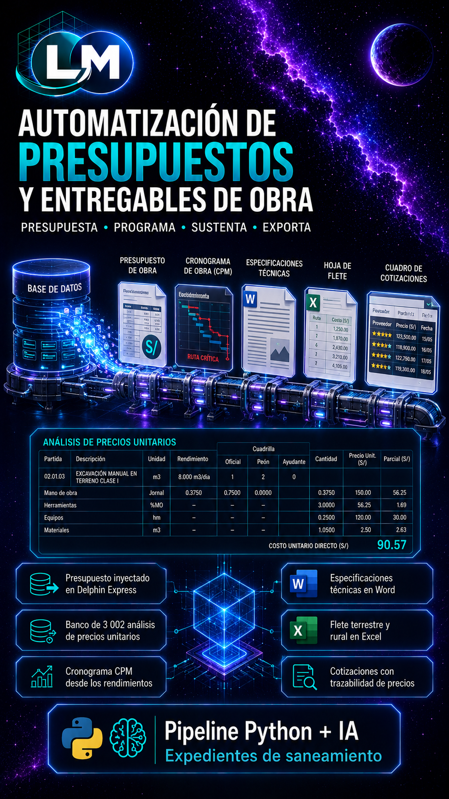
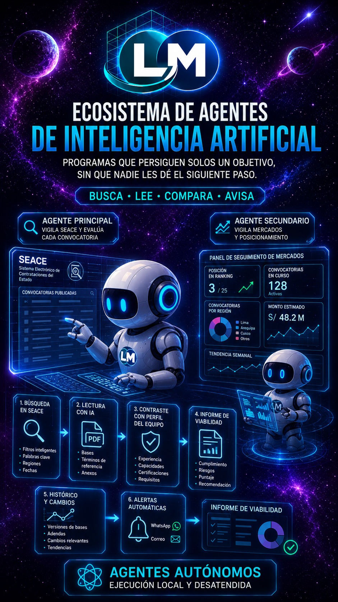

# Plan de Mejoras del Portafolio Profesional — LMCE
## Transición a Experto en Inteligencia Artificial, Servidores MCP, Plugins y Automatizaciones

> **Destinatario de este documento:** Claude Code / ChatGPT / Asistente de Desarrollo.  
> **Objetivo:** Servir como guía consolidada y autónoma que contiene tanto la síntesis de la sesión de diseño como las especificaciones técnicas para generar las **4 carátulas gráficas** y completar la edición del sitio web [index.html](file:///d:/LAPTOP_LMCE/PORTAFOLIO%20PROFESIONAL/index.html).

---

## 1. 📋 Síntesis de la Conversación y Decisiones Acordadas

### A. Solicitudes y Preguntas del Usuario (Luis Miguel Cruz Efus)
1. **Identidad profesional:** Ya no presentarse como *Desarrollador*, sino como **Experto en Inteligencia Artificial** e **Ingeniero Civil / Especialista BIM**, destacando la creación de **Agentes de Inteligencia Artificial**, **Servidores MCP (Model Context Protocol)** y **Plugins**.
2. **Ajustes de Copy en Hero y Secciones:**
   * Headline del Hero: Modificar a algo como *"...software de ingeniería que automatiza flujos de trabajo"*.
   * Proyectos reales (PTAR y PTAP): Ayudar a decidir entre *"diseñadas"* vs *"desarrolladas bajo metodología BIM"*.
   * Reemplazo de *"automatiza el cálculo"*: Actualizarlo porque el software propio no solo calcula, sino que automatiza metrados, presupuestos, fletes, cronogramas y memorias técnicas.
3. **Revisión profunda del espacio de trabajo:** Inspeccionar `APPS/`, `01_PRESUPUESTOS/`, `MCPs/`, `0_SKILLS/`, `.agents/`, `AGENTS.md` y `CV/0. BIOGRAFIA/00_Biografía.txt` para fundamentar la web en avances reales y tangibles.
4. **Depuración y Filtro de Elementos (Feedback directo del usuario):**
   * `LMBIMTools` (Plugins Revit): **SÍ VA**.
   * `CopiRobot / ETABS`: **NO VA** como tarjeta independiente (se mantiene integrado dentro de las apps de estructuras existentes).
   * Servidores MCP: **UNIFICAR** Word MCP, Excel MCP y el servidor `delphin-presupuestos` (27 herramientas) en una sola carátula/bloque.
   * `NotebookLM MCP`: **ELIMINADO AL 100%** (descartado por el usuario).
   * `Agente Auditor de Calidad` y `MINIMIRO`: **NO VAN** en el catálogo de carátulas.
   * `Sistema de Presupuestos (01_PRESUPUESTOS)`: **SÍ VA** con máximo protagonismo (Pipeline Delphin Express + SQLite + Cronogramas CPM + Fletes MTC + Especificaciones Word).
   * `Agente SEACE Licitaciones` y `Agente Financiero Hapi (Bolsa)`: **SÍ VAN**, unificados bajo un solo bloque de **Ecosistema de Agentes de Inteligencia Artificial**.
   * `Agentes internos de soporte técnico (auditoría/transcripción)`: **ELIMINADOS** de la vitrina comercial.

---

## 2. 🎨 Conteo Final: Las 4 Carátulas Necesarias

El ecosistema nuevo se presentará en **4 grandes tarjetas de impacto**, para las cuales se generarán 4 carátulas (formato vertical retrato tipo cover-portrait `9:16` o `3:4`, paleta dark blueprint, acentos ámbar `oklch(0.78 0.14 65)` y azul cyan `oklch(0.62 0.12 245)`):

```
┌─────────────────────────────────────────────────────────────────────────────┐
│ 1. LMBIMTools (Suite de Plugins para Autodesk Revit 2025 · 2026 · 2027)     │
│    • Modelado paramétrico 3D de armaduras en vigas y columnas               │
│    • AutoCrop inteligente, coloreado 3D, catálogo peruano y detallado 2D    │
├─────────────────────────────────────────────────────────────────────────────┤
│ 2. Suite Unificada de Servidores MCP (Model Context Protocol)               │
│    • Servidor delphin-presupuestos (27 herramientas para Delphin / SQLite)  │
│    • Servidor Word MCP (maquetación automática, campos SEQ y plantillas)    │
│    • Servidor Excel MCP (fórmulas vivas SUBTOTAL, autofiltros y gráficos)   │
├─────────────────────────────────────────────────────────────────────────────┤
│ 3. Sistema Automatizado de Presupuestos y Entregables de Obra                │
│    • Pipeline IA + Python: Presupuestos inyectados a Delphin Express        │
│    • Cronogramas de obra CPM automáticos desde rendimientos de APUs         │
│    • Fletes terrestres y rurales MTC + Especificaciones técnicas en Word    │
├─────────────────────────────────────────────────────────────────────────────┤
│ 4. Ecosistema de Agentes de Inteligencia Artificial (AI Agents Suite)       │
│    • Agente SEACE Licitaciones: Búsqueda, parsing de TDRs y viabilidad      │
│    • Agente Financiero Hapi: Monitoreo, balance en USD y registro de trades │
└─────────────────────────────────────────────────────────────────────────────┘
```

---

## 3. 📝 Fichas Técnicas y Prompts para Generar las 4 Carátulas con ChatGPT / DALL-E / Midjourney

### Carátula 1: `LMBIMTools — Plugins para Autodesk Revit`
* **Archivo de destino:** `imagenes/lm_ingenieria/lmbimtools/00_caratula.png`
* **Titular en portada:** `LMBIMTools`
* **Subtítulo / Badges:** `Add-In Revit 2025 – 2027 · .NET · Parametric Rebar & Detailing`
* **Concepto visual:**
  * Vista 3D isométrica de elementos de concreto armado (columna y viga) con armadura de acero modelada en 3D transparente (estribos con zonas de confinamiento y barras longitudinales coloreadas por diámetro).
  * Interfaz flotante de Ribbon de Revit con botones técnicos (`AutoCrop`, `Acero Columna`, `Detallar Sección`).
  * Estilo blueprint oscuro con líneas técnicas de ingeniería, fondo grafito profundo `#15171c` y acentos ámbar/dorado.
* **Prompt para ChatGPT / DALL-E:**
  > *"A sleek, high-tech dark blueprint illustration of an Autodesk Revit engineering plugin called 'LMBIMTools'. Visual elements include a semi-transparent 3D reinforced concrete column and beam with intricate parametric rebar detailing, stirrups with seismic confinement zones highlighted in glowing amber and cyan lines. Subtle CAD UI ribbon elements with clean technical wireframes and typography reading 'LMBIMTOOLS'. Modern dark graphite background with isometric blueprint grid, premium engineering aesthetics, ultra-sharp detail, 9:16 vertical poster format."*

---

### Carátula 2: `Suite Unificada de Servidores MCP (Model Context Protocol)`
* **Archivo de destino:** `imagenes/lm_ingenieria/servidores_mcp/00_caratula.png`
* **Titular en portada:** `Suite de Servidores MCP`
* **Subtítulo / Badges:** `Model Context Protocol · delphin-presupuestos · Word MCP · Excel MCP`
* **Concepto visual:**
  * Un núcleo de inteligencia artificial / protocolo MCP interconectado con 3 nodos holográficos flotantes:
    1. Base de datos SQLite / Delphin Express (cubo de datos con engranajes de presupuestos).
    2. Documento de Word editorial (páginas con tablas estilizadas, campos SEQ y tipografía perfecta).
    3. Hoja de cálculo Excel (celdas con fórmulas financieras vivas y gráficos vectoriales).
  * Conexiones de datos brillantes en ámbar y azul cobalto sobre fondo blueprint oscuro.
* **Prompt para ChatGPT / DALL-E:**
  > *"A modern, futuristic technological cover art representing 'Model Context Protocol (MCP) Servers Suite' for AI agents. In the center, a glowing, sophisticated neural node connects via fiber-optic data streams to three floating holographic modules: an SQLite engineering database badge, a structured Word document with automated pagination lines, and an interactive dynamic Excel spreadsheet with formulas and charts. Dark graphite and midnight blue background with precise vector blueprint circuitry and subtle amber glow. Professional, minimal, elegant software engineering poster, 9:16 vertical format."*

---

### Carátula 3: `Sistema Automatizado de Presupuestos y Entregables de Obra`
* **Archivo de destino:** `imagenes/lm_ingenieria/automatizacion_presupuestos/00_caratula.png`
* **Titular en portada:** `Automatización de Presupuestos`
* **Subtítulo / Badges:** `Pipeline Python + Delphin Express SQLite · Cronogramas CPM · Fletes MTC`
* **Concepto visual:**
  * Pipeline de ingeniería de costos: flujo automatizado que parte desde datos de obra pública (saneamiento/infraestructura), pasa por un motor de validación con IA y se inyecta en bases de datos SQLite de Delphin Express.
  * Elementos gráficos: Diagrama de Gantt / ruta crítica CPM estilizado, desglose de costos WBS/APUs y fórmulas de fletes de transporte terrestre.
* **Prompt para ChatGPT / DALL-E:**
  > *"A sophisticated architectural and civil engineering cost automation pipeline graphic. Visualizing an intelligent workflow from cost data to automated outputs: a glowing Gantt chart with CPM critical path milestones, an SQLite database container with unit cost analysis (APU) structures, and technical transport freight calculation matrices. Dark blueprint background with glowing amber coordinate lines, clean minimalist data typography, 9:16 vertical engineering software cover style."*

---

### Carátula 4: `Ecosistema de Agentes de Inteligencia Artificial`
* **Archivo de destino:** `imagenes/lm_ingenieria/agentes_ia/00_caratula.png`
* **Titular en portada:** `Ecosistema de Agentes de IA`
* **Subtítulo / Badges:** `Agente Licitaciones SEACE · Agente Financiero Hapi · Automatización Autónoma`
* **Concepto visual:**
  * Representación de agentes inteligentes autónomos de propósito especializado:
    1. Agente SEACE: Radar/escáner procesando documentos oficiales de contratación pública del Estado (TDRs y bases de licitación).
    2. Agente Financiero Hapi: Gráficos de tendencias bursátiles, monitoreo de cartera en tiempo real y balance en USD.
  * Líneas neuronales precisas, interfaz HUD futurista pero sobria sobre fondo oscuro de ingeniería.
* **Prompt para ChatGPT / DALL-E:**
  > *"A high-end technological cover art showcasing an 'Ecosystem of Autonomous AI Agents'. Visualizes two specialized AI agents in action: an intelligent procurement agent scanning and parsing official PDF bidding documents with evaluation metrics, and a financial investment agent monitoring real-time stock portfolio charts and USD asset positions. Sophisticated dark tech UI dashboard, HUD overlays, glowing amber accents, blueprint data grid, clean and authoritative AI engineering presentation, 9:16 vertical format."*

---

## 4. 💻 Especificaciones de Implementación para Claude Code en `index.html`

### 1. Metadatos y Schema.org (líneas 1 a 65):
```html
<title>Luis Miguel Cruz Efus — Ingeniero Civil · Especialista BIM · Experto en Inteligencia Artificial</title>
<meta name="description" content="Portafolio profesional de Luis Miguel Cruz Efus. Expedientes con flujo BIM, saneamiento y PTAR, servidores MCP, agentes de inteligencia artificial y software de ingeniería.">
<!-- Schema.org Person JSON-LD -->
"jobTitle": "Ingeniero Civil · Especialista BIM · Experto en Inteligencia Artificial",
"knowsAbout": [
  "Ingeniería Civil",
  "BIM",
  "Revit",
  "Inteligencia Artificial",
  "Agentes de IA",
  "Servidores MCP (Model Context Protocol)",
  "Automatización de Presupuestos",
  "Saneamiento",
  "PTAR",
  "PTAP",
  "Ingeniería Estructural",
  "Presupuestos y Metrados"
]
```

### 2. Header y Barra de Navegación:
* **Badge de Identidad:**
  `◆ Ingeniero Civil · Especialista BIM · Experto en Inteligencia Artificial`
* **Menú Superior & Menú Móvil:**
  `<a href="#perfil">Perfil</a>`  
  `<a href="#proyectos">Proyectos</a>`  
  `<a href="#aplicaciones">Aplicaciones</a>`  
  `<a href="#ia-automatizacion">IA & Automatización</a>`  
  `<a href="#stack">Stack</a>`  
  `<a href="#contacto">Contacto</a>`

### 3. Sección Hero:
* **Kicker:**
  `◆ Portafolio profesional · Saneamiento · BIM · IA & Agentes · Aplicaciones`
* **Headline Principal:**
  ```html
  Expedientes técnicos<br>
  con flujo <em>BIM</em>, <br>
  y <em>software de ingeniería</em><br>
  que automatiza flujos de trabajo.
  ```
* **Tarjeta 01 (Casos de éxito):**
  `PTAR y PTAP desarrolladas bajo metodología BIM: arquitectura, hidráulica, cálculo y presupuesto.`
* **Tarjeta 02 (Herramientas propias):**
  `Software y automatizaciones que optimizan cálculos, presupuestos, metrados y entregables técnicos.`
* **Resumen N.01:**
  `Cinco años de trayectoria —tres en obra, dos en consultoría— en saneamiento, PTAR, PTAP e infraestructura. Integro modelado BIM en Revit, cálculo hidráulico y presupuestos S10 / Delphin con el desarrollo de software especializado, servidores MCP y agentes de inteligencia artificial que automatizan flujos de trabajo de ingeniería.`

### 4. Sección § 01 Perfil Profesional:
* Párrafos actualizados destacando la combinación de obra en campo (221 viviendas), expedientes técnicos de PTAR/PTAP y creación de agentes de IA, servidores MCP y complementos para Autodesk Revit.

### 5. [NUEVA SECCIÓN] Sección § 04 — Inteligencia Artificial & Automatización Avanzada:
Insertar antes de `<!-- ============ STACK ============ -->`:
```html
<!-- ============ IA & AUTOMATIZACIÓN ============ -->
<section id="ia-automatizacion" class="py-24 lg:py-32 relative" style="background: oklch(0.14 0.012 250 / 0.5);">
  <div class="max-w-7xl mx-auto px-6 lg:px-10">

    <div class="sec-label">
      <span class="sec-num">§ 04</span>
      <h2 class="sec-title">Inteligencia Artificial & <em>Automatización</em></h2>
      <span class="sec-rule"></span>
    </div>

    <div class="grid md:grid-cols-12 gap-8 mb-16" data-reveal>
      <div class="md:col-span-8">
        <p class="text-lg leading-relaxed" style="color: var(--text-dim);">
          Diseño y despliegue de <span style="color: var(--text);">servidores MCP</span>, <span style="color: var(--text);">plugins para Revit</span>, <span style="color: var(--text);">agentes de IA autónomos</span> y pipelines de presupuestos en SQLite que transforman tareas técnicas complejas en flujos automatizados de alta precisión.
        </p>
      </div>
      <div class="md:col-span-4 flex md:justify-end items-end">
        <div class="tick-row w-full"><span>4 pilares de innovación</span></div>
      </div>
    </div>

    <!-- Grilla de las 4 tarjetas -->
    <div class="grid sm:grid-cols-2 lg:grid-cols-4 gap-6">

      <!-- Tarjeta 1: LMBIMTools -->
      <div class="card group" data-reveal>
        <div class="cover-portrait">
          <div class=&quot;mono text-[0.62rem] uppercase tracking-[0.18em] mb-2&quot; style=&quot;color: var(--accent);&quot;>Revit Add-In · .NET</div><div class=&quot;serif text-2xl&quot;>LMBIM<em style=&quot;color: var(--accent); font-style: italic;&quot;>Tools</em></div></div>';">
        </div>
        <div class="p-6">
          <div class="flex items-center gap-2 mb-3">
            <span class="chip accent">Plugins BIM</span>
            <span class="chip">Revit 2025–2027</span>
          </div>
          <h3 class="font-medium text-lg mb-2">LMBIMTools — Plugins para Autodesk Revit</h3>
          <p class="text-sm leading-relaxed" style="color: var(--muted);">
            Suite de complementos en C#/.NET para modelado 3D paramétrico de armaduras en vigas y columnas (confinamiento sísmico), AutoCrop inteligente, coloreado 3D y despiece 2D automático con acotado.
          </p>
        </div>
      </div>

      <!-- Tarjeta 2: Servidores MCP -->
      <div class="card group" data-reveal>
        <div class="cover-portrait">
          <div class=&quot;mono text-[0.62rem] uppercase tracking-[0.18em] mb-2&quot; style=&quot;color: var(--accent);&quot;>Model Context Protocol</div><div class=&quot;serif text-2xl&quot;>Servidores <em style=&quot;color: var(--accent); font-style: italic;&quot;>MCP</em></div></div>';">
        </div>
        <div class="p-6">
          <div class="flex items-center gap-2 mb-3">
            <span class="chip accent">Servidores MCP</span>
            <span class="chip">Delphin · Office</span>
          </div>
          <h3 class="font-medium text-lg mb-2">Suite Unificada de Servidores MCP</h3>
          <p class="text-sm leading-relaxed" style="color: var(--muted);">
            Servidores locales para agentes de IA: <strong>delphin-presupuestos</strong> (27 herramientas para SQLite / Delphin Express), <strong>Word MCP</strong> (maquetación con campos SEQ) y <strong>Excel MCP</strong> (fórmulas vivas y subtotales).
          </p>
        </div>
      </div>

      <!-- Tarjeta 3: Automatización de Presupuestos -->
      <div class="card group" data-reveal>
        <div class="cover-portrait">
          <div class=&quot;mono text-[0.62rem] uppercase tracking-[0.18em] mb-2&quot; style=&quot;color: var(--accent);&quot;>Pipeline Python + IA</div><div class=&quot;serif text-2xl&quot;>Presupuestos <em style=&quot;color: var(--accent); font-style: italic;&quot;>SQLite</em></div></div>';">
        </div>
        <div class="p-6">
          <div class="flex items-center gap-2 mb-3">
            <span class="chip accent">Costos & Entregables</span>
            <span class="chip">SQLite / CPM</span>
          </div>
          <h3 class="font-medium text-lg mb-2">Automatización Integral de Presupuestos</h3>
          <p class="text-sm leading-relaxed" style="color: var(--muted);">
            Pipeline autónomo de ingeniería de costos: generación e inyección directa en Delphin Express SQLite, cronogramas de obra CPM automáticos desde APUs, fletes MTC y generador de especificaciones técnicas.
          </p>
        </div>
      </div>

      <!-- Tarjeta 4: Ecosistema de Agentes de IA -->
      <div class="card group" data-reveal>
        <div class="cover-portrait">
          <div class=&quot;mono text-[0.62rem] uppercase tracking-[0.18em] mb-2&quot; style=&quot;color: var(--accent);&quot;>AI Agents Suite</div><div class=&quot;serif text-2xl&quot;>Agentes de <em style=&quot;color: var(--accent); font-style: italic;&quot;>IA</em></div></div>';">
        </div>
        <div class="p-6">
          <div class="flex items-center gap-2 mb-3">
            <span class="chip accent">Agentes Autónomos</span>
            <span class="chip">SEACE · Hapi</span>
          </div>
          <h3 class="font-medium text-lg mb-2">Ecosistema de Agentes de Inteligencia Artificial</h3>
          <p class="text-sm leading-relaxed" style="color: var(--muted);">
            Agentes especializados: <strong>Agente SEACE Licitaciones</strong> (búsqueda, parsing de TDRs y evaluación de viabilidad contractual con IA) y <strong>Agente Financiero Hapi</strong> (monitoreo bursátil, cartera en USD y registro de trades).
          </p>
        </div>
      </div>

    </div>

  </div>
</section>
```

### 6. Sección § 05 Stack Tecnológico:
* Renumerar a `§ 05`.
* Agregar en la marquesina: `Model Context Protocol (MCP)`, `Agentes de IA`, `delphin-presupuestos`, `Revit API Add-Ins`, `SQLite Delphin`, `Python`, `C# .NET`, `Claude Code`.
* En la tarjeta *Diferencial*:
  `Inteligencia Artificial aplicada · Servidores MCP (Delphin/Word/Excel) · Agentes autónomos · Plugins Revit API (LMBIMTools) · Automatización de presupuestos SQLite`

### 7. Sección § 06 Contacto:
* Renumerar a `§ 06` y coordenada `N.06 · Contacto`.

---

© 2026 · Luis Miguel Cruz Efus — Portafolio Profesional
